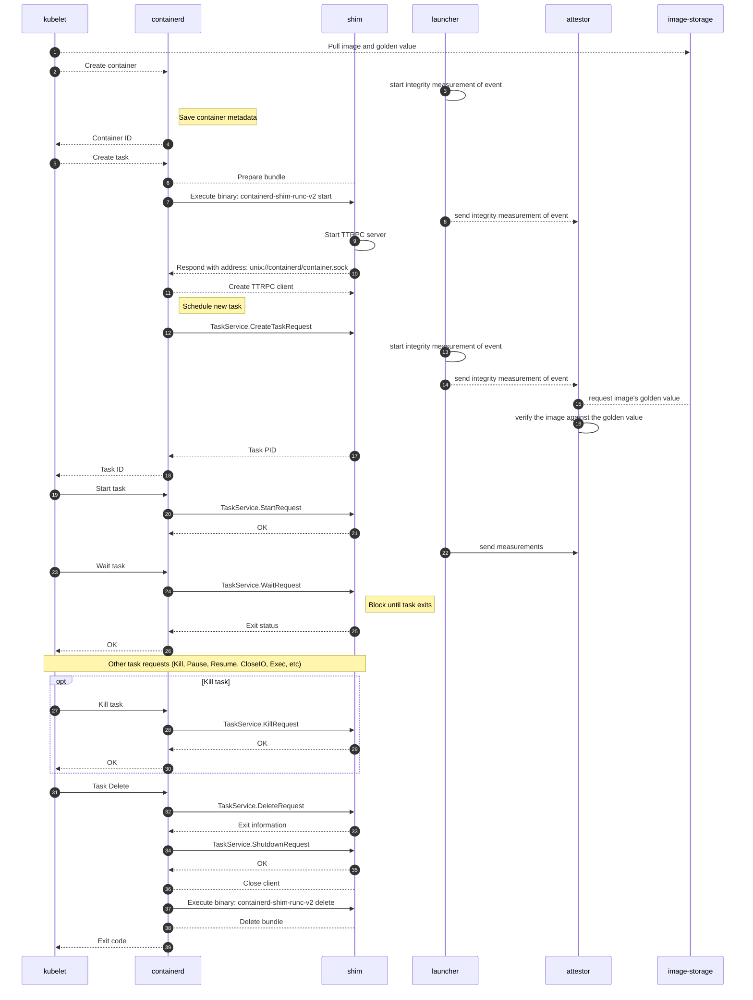

# Design for Trusted Container Launcher

## Components of Trusted Container Launcher

### 1. kubelet

1. extend `startContainer` method for getting integrity measurement eventlog the start container event.

   The event should have container ID and POD ID associated.  

   `startContainer` is defined in `pkg/kubelet/kuberuntime/kuberuntime_container.go`.

   This method calls the CRI (Container Runtime Interface) to create and start containers.

2. extend `pullImage` method for attestation of the image against golden value.

   
   
   

containerd

trusted container launcher 

launcher

attestor

image-storage

    

## Workflow

The high-level flow is as follows:

1. The client requests K8S to create a confidential container

2. Kubernetes scheduler decides which node a Pod should run on, based on factors like resource requirements, affinity/anti-affinity, taints, and tolerations.

3. Once a Pod is scheduled to a node, the kubelet on that node is notified that a new Pod needs to be run.

4. If the required container image is not on the node, the kubelet commands the container runtime through the Container Runtime Interface (CRI) to pull the image from the container image registry.

5. After the image is pulled, the CRI invokes the integrity measurement for the measurement of the pulled image.

6. The CRI also invokes image golden value retrieval.

7. Trusted Container Launcher

  - 7.1 In the secure boot mode, the image is attested locally.
  
    - 7.1.1 The image storage not only stores the images but also the image's golden value.
  
    - 7.1.2 The Trusted Container Launcher attests the image's golden value against the measurement, if matches, it proceeds, if not, it returns "NOT verified".

    - 7.1.3 If it matches, the Trusted Container Launcher also triggers the measurement of the container loading process, and sends eventlog to remote attestor.

  - 7.2 In remote attestation mode, Trusted Container Launcher sends the report (image golden value) to the remote attestor. 
      
    - 7.2.1 The remote attestor requests for image storage service for golden value of the image, and attest from here. 
      
    - 7.2.2 If it matches, the Trusted Container Launcher also triggers the measurement of the container loading process, and sends eventlog to remote attestor.

8. After the image is attested (either locally or remotely).

   The container runtime creates the container based on the Pod's specification.

   The containerd lays out the container's filesystem, and creates the necessary config information.

10. The containerd invokes the runtime over an API to create/start/stop the container, of which the create process is measured, and eventlog is sent to remote attestor.

11. The runc is invoked to execute the container.

The following sequence diagram shows the flow of actions for starting a confidential container through the Trusted Container Launcher.

